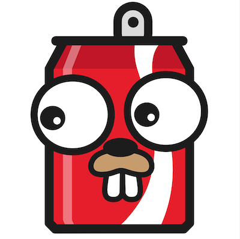

    
    

# POP

## A Tasty Treat For All Your Database Needs

So what does Pop do exactly? Well, it wraps the absolutely amazing [https://github.com/jmoiron/sqlx](https://github.com/jmoiron/sqlx) library. It cleans up some of the common patterns and work flows usually associated with dealing with databases in Go.

Pop makes it easy to do CRUD operations, run migrations, and build/execute queries.

Pop, by default, follows conventions that were influenced by the [ActiveRecord](http://www.rubyonrails.org) Ruby gem. What does this mean?

* Tables must have an "id" column and a corresponding "ID" field on the `struct` being used.
* If there is a `timestamp` column named `created_at`, and a `CreatedAt time.Time` attribute on the `struct`, it will be set with the current time when the record is created.
* If there is a `timestamp` column named `updated_at`, and a `UpdatedAt time.Time` attribute on the `struct`, it will be set with the current time when the record is updated.
* Default database table names are lowercase, plural, and underscored versions of the `struct` name. Examples: User{} is "users", FooBar{} is "foo_bars", etc...

Want to know more? Take a look at the documentation!

## Documentation

Please visit [http://gobuffalo.io](https://gobuffalo.io/docs/db/getting-started) for the latest documentation, examples, and more.

### Quick Start
* [CLI Installation](https://gobuffalo.io/docs/db/toolbox)
* [Configuration](https://gobuffalo.io/docs/db/configuration)

## Shoulders of Giants

Pop would not be possible if not for all of the great projects it depends on. Please see [SHOULDERS.md](SHOULDERS.md) to see a list of them.

## Contributing

First, thank you so much for wanting to contribute! It means so much that you care enough to want to contribute. We appreciate every PR from the smallest of typos to the be biggest of features.

To contribute, please read the contribution guidelines: [CONTRIBUTING](.github/CONTRIBUTING.md)
